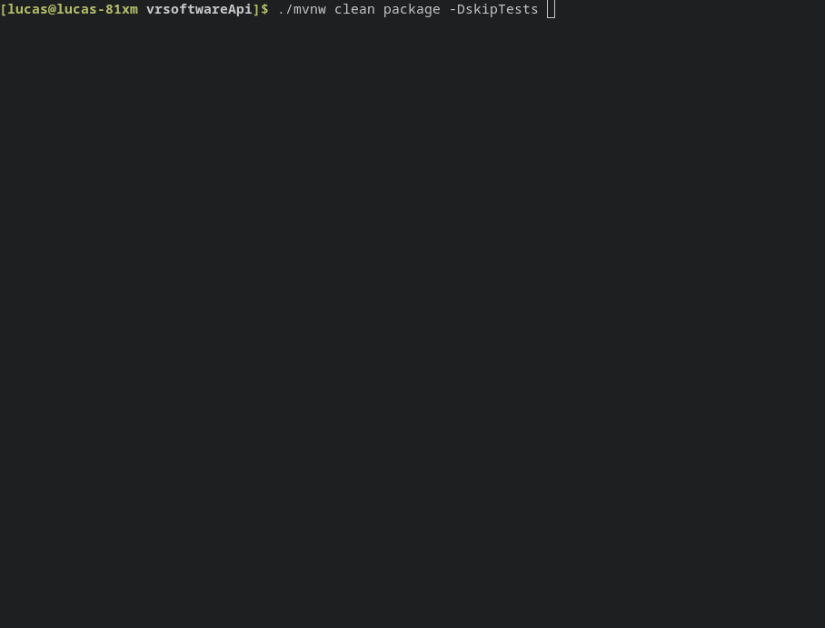

# vrsoftwareApi

Este projeto foi gerado com [start.spring](https://start.spring.io/).
Versão do Spring boot 2.7.4
## Execução do projeto
Para executar o projeto deverá ter na sua máquina
*  OpenJDK 11 ou JDK 11
* [Docker](https://docs.docker.com/engine/install/)
* [Docker Compose](https://docs.docker.com/compose/install/)
* 
  O banco utilizado foi para armazenamento dos dados foi [Postgres:13.1-alpine](https://hub.docker.com/_/postgres).
### Execuçao da Api no abinete linux
[Clone o projeto](https://docs.github.com/pt/repositories/creating-and-managing-repositories/cloning-a-repository) e abra o seu terminal no diretório raiz do projeto e digite o seginte comando:
```shell
./mvnw clean package -DskipTests 
```
Este comando traforma o projeto em um arquivo executável.jar



```shell
sudo docker build . -t vr
```
[Este comando executarar os comandos de criação imagens do Docker a partir de um Dockerfile](https://docs.docker.com/engine/reference/commandline/build/)


Para verificar sé a imagem docker foi criada execute 

```shell
sudo docker images
```

Ainda na raiz do projeto digite o seguinte comando 
* 1
```shell
cd  src/main/docker/
```
* 2
```shell
sudo docker-compose up
```


